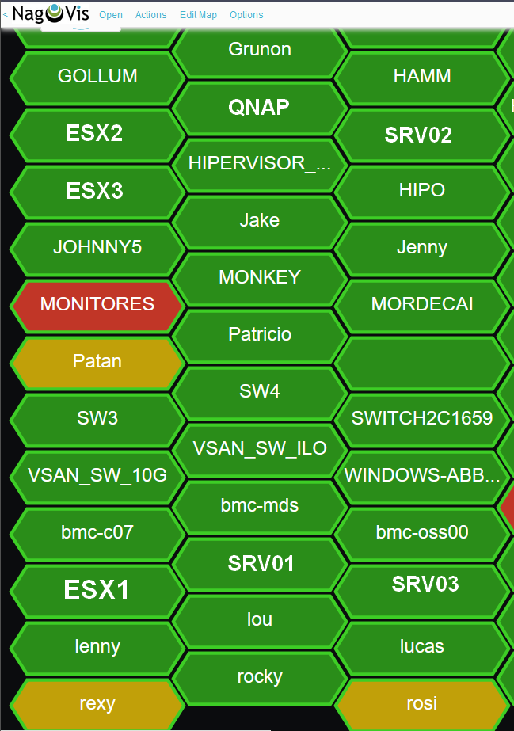
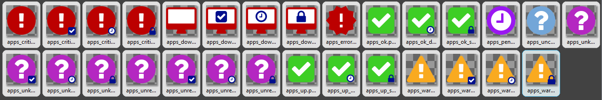

# nagvis-icons
Varios iconsets para su uso en NAGVIS con todas las variantes (ack, dt y stale) y para una buena visualización en una pantalla grande o videowall.
- **hexagonal** hexagono alargado en horizontal para que quepa el nombre y crear un mapa con "tiles" ideal para pantallas grandes. Tamaño 224x70 pixels.
- **apps** iconos usando *Material Design* y *Fontawesome* con un icono de estado en pequeño y azul, ideal para pantallas grandes. Tamaño 64x64 pixels.

## Instalación
Descomprimir en la ruta donde esté instalado Nagvis: p.e. */usr/local/nagvis/share/userfiles/images/iconsets*

## Capturas de pantalla
### Hexagonal

### Apps

# Nagvis Heatmap

## nagvis-genera-heatmap.sh
Shell script que genera un mapa de calor con los icones hexagonales.
Necesita livestatus para obtener los datos y estado de los hosts.
Para instalar modificar las variables de los directorios de instalación de NAGVIS a las propias.
Se puede añadir al crontab para que regenere el mapa de forma automática cada 5 minutos:
`*/5 * * * * /opt/arcs/scripts/nagvis-genera-heatmap.sh >/dev/null 2>&1`
