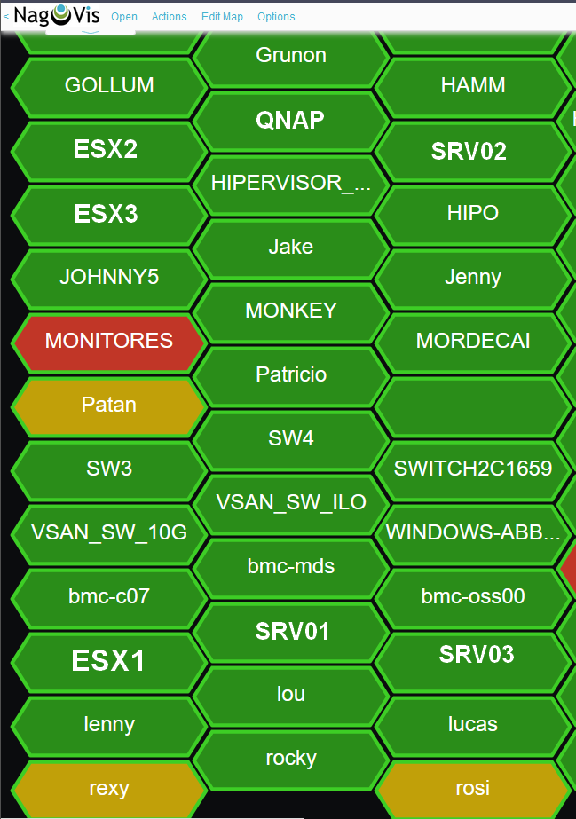

# nagvis-icons
Varios iconsets para su uso en NAGVIS con todas las variantes (ack, dt y stale) y para una buena visualización en una pantalla grande o videowall.
- **hexagonal** hexagono alargado en horizontal para que quepa el nombre y crear un mapa con "tiles". Tamaño 224x70 pixels.
- **simbols** iconos usando Material design y Fontawesome con el estado en pequeño y azul. Tamaño 64x64 pixels.
- **simbols2** iconos usando Material design y Fontawesome, donde los ack, stale y dt son enlaces al mismo. Tamaño 64x64 pixels.

## Instalación
Descomprimir en la ruta donde esté instalado Nagvis: p.e. */usr/local/nagvis/share/userfiles/images/iconsets*

## Capturas de pantalla
### Hexagonal

### Simbols

### Simbols2

